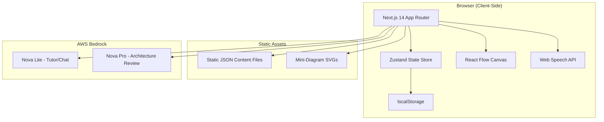
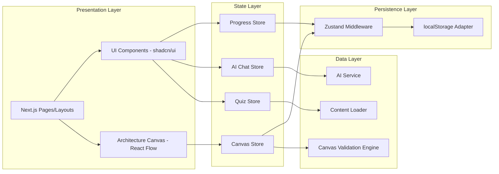

# Design Document: QualCheck

## Overview

QualCheck is a client-side interactive learning platform for AWS SAP-C02 certification, built with Next.js 14 App Router. The MVP covers the Networking section (18 topics) and combines structured content delivery, AI-powered tutoring, architecture diagram building, and progression gating — all running in the browser with no backend infrastructure.

**Key Design Decisions:**
- **No backend/auth for MVP** — All state lives in browser localStorage via Zustand persistence. AI calls go directly to AWS Bedrock from the client (or via a thin Next.js API route for key management).
- **Static JSON content** — All learning material is bundled at build time, enabling zero-cost hosting on any static CDN.
- **Two AI models** — Nova Lite (fast, cheap) for conversational tutoring and concept assessment; Nova Pro (capable, slower) for architecture diagram review with structured rubric scoring.
- **React Flow canvas** — Provides the interactive diagram builder with a three-tier component model (containers, standalone, attached) and 9 placement validation rules.
- **Progressive gating** — Enforces sequential learning: Topic → Concept Chat → Mini-Quiz → (every 2-3 topics) Grouped Diagram → Section Quiz → Capstone.

## Architecture

### High-Level Architecture



### Application Layer Architecture



### Routing Structure

| Route | Purpose |
|-------|---------|
| `/` | Landing / Progress Dashboard |
| `/topics/[topicId]` | Topic content page with AI tutor |
| `/topics/[topicId]/chat` | Concept Chat assessment |
| `/topics/[topicId]/quiz` | Mini-Quiz |
| `/diagrams/[taskId]` | Grouped Diagram Task |
| `/section-quiz` | Section Quiz (20 questions) |
| `/capstone/[challengeId]` | Capstone Architecture Challenge |
| `/flashcards` | Flashcard review |
| `/glossary` | Glossary view |

## Components and Interfaces

### Core UI Components

#### TopicPage
- Renders structured content sections from static JSON
- Hosts the AI Tutor chat dock at the bottom
- Renders Keyword Tooltips inline with content
- Manages topic reading state

#### ConceptChat
- Streaming chat interface for AI-assessed understanding check
- Tracks exchange count (max 4 Learner messages)
- Determines pass/fail based on AI assessment
- Unlocks Mini-Quiz on pass

#### MiniQuiz
- Pool-based question selection (8-10 questions per topic)
- Tracks correct answer accumulation (3 to pass)
- Provides skip and refresh options
- Shows explanations on incorrect answers

#### ArchitectureCanvas
- React Flow-based interactive diagram builder
- Three-tier component palette: containers, standalone, attached
- 8 connection types with distinct visual styles
- Real-time placement validation (9 rules)
- Submit for AI review (Nova Pro)

#### AITutorChat
- Docked chat interface on topic pages
- Streaming responses from Nova Lite
- Topic-aware context injection
- 20-message soft limit per session
- Voice input integration

#### ProgressDashboard
- Completion status for all 18 topics
- Weak area identification from quiz performance
- Daily review queue (flashcards + topics)
- Study streak tracking

#### FlashcardDeck
- Flip card interface (front: question, back: answer)
- Got-it / Review-again tracking
- Session-based rotation
- ~60 cards for Networking section

#### GlossaryView
- Searchable list of ~30 entries
- Real-time filtering by search query
- Category filter (exam terms, services, architecture patterns)

#### KeywordTooltip
- Three types: exam-signal (gold), service-reference (blue + SVG), architecture-term (purple)
- Hover/tap activation
- Displays definition and optional mini-diagram SVG

#### VoiceInput
- Push-to-talk button component
- Web Speech API integration
- Editable transcription before send
- Graceful degradation when API unavailable

### Service Interfaces

#### ContentService
```typescript
interface ContentService {
  getTopicContent(topicId: string): TopicContent;
  getQuizPool(topicId: string): QuizQuestion[];
  getSectionQuizQuestions(): QuizQuestion[];
  getDiagramTask(taskId: string): DiagramTask;
  getFlashcards(): Flashcard[];
  getGlossaryEntries(): GlossaryEntry[];
  getKeywordTooltips(): KeywordTooltip[];
  getCapstoneChallenge(challengeId: string): CapstoneChallenge;
}
```

#### AIService
```typescript
interface AIService {
  // Nova Lite - streaming chat
  streamTutorResponse(
    messages: ChatMessage[],
    topicContext: TopicContext
  ): AsyncIterable<string>;

  // Nova Lite - concept assessment
  assessConceptUnderstanding(
    messages: ChatMessage[],
    topicId: string
  ): AsyncIterable<string>;

  // Nova Pro - architecture review
  reviewArchitecture(
    diagram: DiagramSubmission,
    taskPrompt: string
  ): Promise<ArchitectureReview>;
}
```

#### CanvasValidationEngine
```typescript
interface CanvasValidationEngine {
  validatePlacement(
    component: CanvasComponent,
    position: Position,
    currentDiagram: DiagramState
  ): ValidationResult;

  validateDiagram(diagram: DiagramState): ValidationResult[];

  getPlacementRules(): PlacementRule[];
}

interface ValidationResult {
  ruleId: string;
  severity: 'error' | 'warning';
  message: string;
  affectedComponents: string[];
}
```

#### ProgressionEngine
```typescript
interface ProgressionEngine {
  isTopicUnlocked(topicId: string): boolean;
  isQuizUnlocked(topicId: string): boolean;
  isDiagramTaskPending(clusterId: string): boolean;
  isSectionQuizUnlocked(): boolean;
  isCapstoneUnlocked(): boolean;
  completeConceptChat(topicId: string): void;
  completeMiniQuiz(topicId: string): void;
  completeDiagramTask(taskId: string): void;
  completeSectionQuiz(score: number): boolean; // returns pass/fail
}
```

### State Store Interfaces

```typescript
// Progress Store
interface ProgressState {
  topicProgress: Record<string, TopicProgress>;
  diagramTaskProgress: Record<string, DiagramTaskProgress>;
  sectionQuizAttempts: SectionQuizAttempt[];
  capstoneProgress: Record<string, CapstoneProgress>;
  flashcardProgress: Record<string, FlashcardStatus>;
  studyStreak: StudyStreakData;
  lastActivityDate: string;
}

interface TopicProgress {
  topicId: string;
  readComplete: boolean;
  conceptChatPassed: boolean;
  miniQuizPassed: boolean;
  miniQuizAttempts: number;
  completedAt?: string;
}

// Canvas Store
interface CanvasState {
  components: CanvasComponentInstance[];
  connections: Connection[];
  selectedComponent: string | null;
  validationErrors: ValidationResult[];
  validationWarnings: ValidationResult[];
}

// AI Chat Store
interface AIChatState {
  messages: ChatMessage[];
  isStreaming: boolean;
  exchangeCount: number;
  sessionMessageCount: number;
  assessmentResult?: 'pass' | 'fail' | null;
}

// Quiz Store
interface QuizState {
  currentQuestions: QuizQuestion[];
  answeredQuestions: AnsweredQuestion[];
  correctCount: number;
  currentQuestionIndex: number;
}
```

## Data Models

### Static Content JSON Schemas

#### Topic Content
```typescript
interface TopicContent {
  id: string;
  title: string;
  sectionId: string;
  clusterId: string;
  order: number;
  explanation: string; // markdown
  analogy: string;
  diagram: string; // SVG reference or inline
  keyPoints: string[];
  examKeywords: KeywordReference[];
  commonMistakes: string[];
  relatedTopics: string[];
}

interface KeywordReference {
  term: string;
  type: 'exam-signal' | 'service-reference' | 'architecture-term';
  definition: string;
  svgDiagram?: string; // path to mini-diagram SVG
}
```

#### Quiz Questions
```typescript
interface QuizQuestion {
  id: string;
  topicId: string;
  question: string;
  options: QuizOption[];
  correctOptionId: string;
  explanation: string;
  difficulty: 'easy' | 'medium' | 'hard';
}

interface QuizOption {
  id: string;
  text: string;
}
```

#### Diagram Task
```typescript
interface DiagramTask {
  id: string;
  clusterId: string;
  title: string;
  prompt: string;
  requiredComponents: string[];
  hints: string[];
  expectedConnections?: ExpectedConnection[];
}

interface CapstoneChallenge {
  id: string;
  title: string;
  scenario: string;
  requirements: string[];
  rubricWeights: RubricWeights;
}

interface RubricWeights {
  correctness: number;  // 0.4
  connectivity: number; // 0.3
  security: number;     // 0.2
  bestPractices: number; // 0.1
}
```

#### Canvas Components
```typescript
interface CanvasComponentDefinition {
  id: string;
  name: string;
  category: 'container' | 'standalone' | 'attached';
  icon: string;
  defaultSize: { width: number; height: number };
  allowedParents?: string[]; // for attached components
  allowedChildren?: string[]; // for containers
  connectionPoints: ConnectionPoint[];
  mvpEnabled: boolean;
}

interface ConnectionType {
  id: string;
  name: string;
  style: ConnectionStyle;
  validSourceTypes: string[];
  validTargetTypes: string[];
}

interface PlacementRule {
  id: string;
  description: string;
  severity: 'error' | 'warning';
  validate: (component: CanvasComponentInstance, diagram: DiagramState) => boolean;
}
```

#### Flashcard & Glossary
```typescript
interface Flashcard {
  id: string;
  topicId: string;
  front: string; // question or term
  back: string;  // answer or definition
  category: string;
}

interface GlossaryEntry {
  id: string;
  term: string;
  definition: string;
  category: 'exam-term' | 'service' | 'architecture-pattern';
  relatedTopics: string[];
}
```

#### Architecture Review Response
```typescript
interface ArchitectureReview {
  overallScore: number; // 0-100
  categories: {
    correctness: CategoryScore;
    connectivity: CategoryScore;
    security: CategoryScore;
    bestPractices: CategoryScore;
  };
  feedback: string;
  suggestions: string[];
}

interface CategoryScore {
  score: number; // 0-100
  weight: number;
  feedback: string;
}
```

### Progression Data Model

```typescript
interface ProgressionConfig {
  sections: Section[];
}

interface Section {
  id: string;
  name: string;
  clusters: Cluster[];
  sectionQuizId: string;
  capstoneIds: string[];
}

interface Cluster {
  id: string;
  topicIds: string[];
  diagramTaskId: string;
}
```

### Content Volume (MVP - Networking Section)

| Content Type | Count |
|-------------|-------|
| Topics | 18 |
| Mini-Quiz Questions (per topic pool) | 8-10 |
| Total Mini-Quiz Questions | 144-180 |
| Grouped Diagram Tasks | 8 |
| Section Quiz Questions | 20 |
| Capstone Challenges | 5 |
| Flashcards | ~60 |
| Glossary Entries | ~30 |
| Keyword Tooltip Definitions | 40-50 |
| Tooltip Mini-Diagram SVGs | 20-25 |

## Correctness Properties

*A property is a characteristic or behavior that should hold true across all valid executions of a system — essentially, a formal statement about what the system should do. Properties serve as the bridge between human-readable specifications and machine-verifiable correctness guarantees.*

### Property 1: Keyword type determines tooltip style

*For any* keyword with a defined type (exam-signal, service-reference, or architecture-term), the rendered tooltip component should apply the corresponding visual style (gold, blue with SVG, or purple respectively). The mapping must be bijective — each type maps to exactly one style.

**Validates: Requirements 1.2**

### Property 2: Concept chat enforces exchange limit

*For any* Concept_Chat session, the system should never allow more than 4 Learner messages to be submitted. After the 4th Learner message, the session must terminate with either a pass or fail result.

**Validates: Requirements 2.3**

### Property 3: Passing concept chat unlocks mini-quiz

*For any* topic where the Concept_Chat is marked as passed, the Mini_Quiz for that same topic should be in an unlocked state.

**Validates: Requirements 3.1**

### Property 4: Quiz pool integrity

*For any* Mini_Quiz session for a given topic, all presented questions must belong to that topic's question pool, and the pool size must be between 8 and 10 questions inclusive.

**Validates: Requirements 3.2**

### Property 5: Quiz completion at 3 correct answers

*For any* sequence of Mini_Quiz answers, the topic should be marked as complete at the exact moment the 3rd correct answer is recorded — not before, not after.

**Validates: Requirements 3.3**

### Property 6: Skip produces a different question

*For any* Mini_Quiz state with remaining unasked questions in the pool, skipping the current question should produce a different question that also belongs to the same topic's pool.

**Validates: Requirements 3.5**

### Property 7: Topic completion unlocks next sequential topic

*For any* topic in the Networking section (except the last), marking it as complete should cause the next topic in sequence to transition from locked to unlocked.

**Validates: Requirements 3.7**

### Property 8: Cluster diagram task gates next cluster

*For any* topic cluster where all topics are completed but the Grouped_Diagram_Task has not been submitted, all topics in the next cluster should remain locked. The Learner cannot bypass the diagram task.

**Validates: Requirements 4.1, 4.5, 8.3**

### Property 9: Diagram submission unlocks regardless of quality

*For any* Grouped_Diagram_Task submission (regardless of diagram content, component count, or AI feedback score), the next topic cluster should be unlocked immediately upon submission.

**Validates: Requirements 4.4**

### Property 10: Section quiz unlocks after all prerequisites

*For any* progression state where all 18 topics are marked complete AND all Grouped_Diagram_Tasks are submitted, the Section_Quiz should be in an unlocked state.

**Validates: Requirements 5.1**

### Property 11: Section quiz pass/fail threshold

*For any* Section_Quiz score, the section should be marked as passed if and only if the score is 14 or higher out of 20 (≥70%). Scores below 14 should result in failure with weak area identification and retake availability.

**Validates: Requirements 5.3, 5.4**

### Property 12: Canvas validation evaluates all rules

*For any* component placement on any diagram state, the validation engine should evaluate all 9 placement rules and return a result for each applicable rule.

**Validates: Requirements 6.3**

### Property 13: Submission eligibility based on validation severity

*For any* diagram state, submission should be blocked if and only if there exists at least one error-level validation violation. Diagrams with only warning-level violations (or no violations) should allow submission.

**Validates: Requirements 6.4, 6.5**

### Property 14: AI review response structure

*For any* valid AI review response from Nova Pro, the parsed result should contain exactly 4 category scores (correctness, connectivity, security, bestPractices) with weights summing to 1.0, an overall score, and textual feedback.

**Validates: Requirements 6.7**

### Property 15: Topic context included in AI requests

*For any* AI Tutor message sent from a Topic_Page, the request payload to Nova Lite should include the current topic's identifier and context data.

**Validates: Requirements 7.2**

### Property 16: AI tutor session message limit

*For any* AI Tutor session, the system should track message count and display a limit notification when the count reaches or approaches 20. The system should enforce the soft limit at 20 messages.

**Validates: Requirements 7.4**

### Property 17: Incomplete quiz blocks next topic

*For any* topic where the Mini_Quiz has not been passed, the next sequential topic should remain in a locked state and navigation to it should be prevented.

**Validates: Requirements 8.2**

### Property 18: Section quiz gates capstone access

*For any* progression state where the Section_Quiz has not been passed, all capstone Architecture_Canvas challenges should remain locked and inaccessible.

**Validates: Requirements 8.4**

### Property 19: State persistence round-trip

*For any* valid application state (including topic progress, quiz attempts, flashcard statuses, diagram task completions, study streak, and dashboard data), serializing to localStorage and deserializing back should produce a state equivalent to the original.

**Validates: Requirements 8.5, 8.6, 9.5, 12.5, 13.1**

### Property 20: Flashcard session management

*For any* flashcard in a review session, marking it as "got-it" should remove it from subsequent draws in that session, while marking it as "review-again" should keep it available for future draws in the same session.

**Validates: Requirements 9.3, 9.4**

### Property 21: Glossary search returns matching entries

*For any* non-empty search query applied to the glossary, all returned entries should contain the search term (case-insensitive) in either their term name or definition. No matching entries should be excluded from results.

**Validates: Requirements 10.2**

### Property 22: Glossary category filter

*For any* category filter (exam-term, service, architecture-pattern) applied to the glossary, all returned entries should belong to the selected category, and no entries of that category should be excluded.

**Validates: Requirements 10.3**

### Property 23: Weak area identification

*For any* set of Mini_Quiz performance data across topics, the weak areas identified should be exactly those topics where the Learner required more attempts than a defined threshold, ordered by attempt count descending.

**Validates: Requirements 12.2**

### Property 24: Daily review queue composition

*For any* progress state, the daily review queue should contain flashcards marked as "review-again" and topics identified as weak areas. Items already completed today should not appear in the queue.

**Validates: Requirements 12.3**

### Property 25: Study streak calculation

*For any* sequence of activity dates, the study streak should equal the count of consecutive calendar days (ending at today) where at least one activity was completed. A gap of one or more days resets the streak to zero.

**Validates: Requirements 12.4**

### Property 26: Corrupted state graceful fallback

*For any* invalid, corrupted, or unparseable data in localStorage, the system should initialize with default state (all topics locked except first, no progress) and produce a user-visible notification about the restoration failure.

**Validates: Requirements 13.4**

### Property 27: Content JSON validation

*For any* valid content JSON file conforming to the schema, build-time validation should pass. *For any* JSON file missing required fields or containing invalid types, validation should fail with descriptive error messages identifying the specific violations.

**Validates: Requirements 14.3**

## Error Handling

### AI Service Errors

| Error Scenario | Handling Strategy |
|---------------|-------------------|
| Nova Lite timeout (>3s to first token) | Display "AI is thinking..." indicator; retry once after 5s; show fallback message suggesting retry |
| Nova Lite streaming interruption | Display partial response with "[response interrupted]" indicator; allow user to request continuation |
| Nova Pro review timeout | Show "Review is taking longer than expected" with progress indicator; timeout at 30s with retry option |
| AI rate limiting | Queue requests; display "Please wait" message; implement exponential backoff |
| Invalid AI response format | Log error; display generic "Unable to process response" message; allow retry |

### State Persistence Errors

| Error Scenario | Handling Strategy |
|---------------|-------------------|
| localStorage full | Notify user; suggest clearing old data; prevent further writes gracefully |
| localStorage unavailable | Initialize with default state; show persistent banner warning that progress won't be saved |
| Corrupted state on hydration | Reset to default state; notify user; log corruption details to console |
| State schema migration needed | Detect version mismatch; apply migration transforms; preserve as much data as possible |

### Canvas Errors

| Error Scenario | Handling Strategy |
|---------------|-------------------|
| Invalid component placement | Show inline error tooltip at placement location; prevent drop; highlight valid zones |
| Connection to invalid target | Reject connection; flash target component red briefly; show tooltip explaining why |
| Diagram exceeds complexity limit | Warn user; suggest simplification; still allow save but warn about review quality |

### Content Loading Errors

| Error Scenario | Handling Strategy |
|---------------|-------------------|
| JSON parse failure | Show error page with "Content unavailable" message; suggest page refresh |
| Missing content file | Display placeholder with "Content coming soon" for missing topics |
| SVG load failure | Show alt text placeholder; log error; don't block page render |

### Voice Input Errors

| Error Scenario | Handling Strategy |
|---------------|-------------------|
| Web Speech API unavailable | Hide voice button entirely; no error shown (graceful degradation) |
| Microphone permission denied | Show one-time tooltip explaining how to enable; hide voice button |
| Transcription failure | Show "Couldn't understand audio" message; keep input field focused for text entry |

## Testing Strategy

### Unit Tests (Example-Based)

Unit tests cover specific scenarios, edge cases, and integration points:

- **Component rendering**: Verify Topic_Page renders all sections, tooltips display correctly, flashcards flip
- **UI state transitions**: Concept Chat pass/fail flows, quiz answer feedback, voice input states
- **Initial state**: Fresh app loads with only first topic unlocked
- **Edge cases**: Empty quiz pools, last topic in section, concurrent state updates
- **Accessibility**: ARIA labels present, keyboard navigation works, focus management correct

### Property-Based Tests

Property tests verify universal correctness properties across randomized inputs. Each property test maps to a Correctness Property defined above.

**Library**: [fast-check](https://github.com/dubzzz/fast-check) (TypeScript property-based testing)

**Configuration**:
- Minimum 100 iterations per property test
- Each test tagged with: `Feature: qualcheck, Property {number}: {property_text}`

**Key property test areas**:
1. **Progression Engine** (Properties 2, 3, 5, 7, 8, 9, 10, 11, 17, 18): Generate random progression states and verify gating rules hold
2. **Canvas Validation** (Properties 12, 13): Generate random component placements and diagram states; verify all rules evaluated and submission eligibility correct
3. **State Persistence** (Properties 19, 26): Generate random valid states; verify round-trip serialization; generate corrupted data and verify graceful fallback
4. **Quiz Logic** (Properties 4, 5, 6): Generate random question pools and answer sequences; verify pool integrity, completion threshold, and skip behavior
5. **Flashcard Session** (Property 20): Generate random session interactions; verify got-it/review-again behavior
6. **Glossary Filtering** (Properties 21, 22): Generate random glossary data and queries; verify filter correctness
7. **Dashboard Calculations** (Properties 23, 24, 25): Generate random activity histories; verify weak areas, review queue, and streak calculations
8. **Content Validation** (Property 27): Generate random valid/invalid JSON structures; verify validation pass/fail
9. **AI Integration** (Properties 14, 15, 16): Generate random AI responses and request contexts; verify parsing and context inclusion
10. **Keyword Mapping** (Property 1): Generate random keywords with types; verify style mapping

### Integration Tests

Integration tests verify external service interactions and end-to-end flows:

- **AI Service**: Verify streaming responses from Nova Lite (mocked Bedrock endpoint)
- **Architecture Review**: Verify Nova Pro returns structured rubric scores (mocked)
- **Web Speech API**: Verify transcription flow with mocked browser API
- **localStorage**: Verify actual browser storage read/write in test environment
- **Build-time validation**: Verify content JSON passes schema validation during build

### Performance Tests

- Page load time < 2 seconds (Lighthouse CI)
- AI time-to-first-token < 3 seconds
- Canvas interaction latency < 100ms
- State persistence < 1 second after activity

### Accessibility Tests

- Automated: axe-core integration in test suite
- Manual: Screen reader testing, keyboard-only navigation, color contrast verification
- Note: Full WCAG 2.1 AA validation requires manual testing with assistive technologies and expert accessibility review

